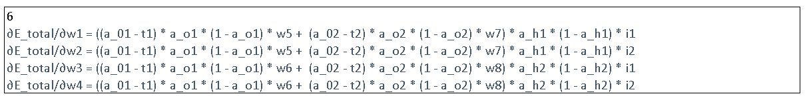

# ERA S6 Assignment

This repository contains the solution to the assignment given in The School of AI's ERA Program Session 6.

There are two parts to the assignment:

Part 1: Calculating the loss for simple neural network with one hidden layer using Excel for various learning rates and showing how loss decreases with each epoch showing the effect of learning rate and back propagation.

Part 2: Training a convolutional neural network on the MNIST dataset using PyTorch and achieving an accuracy of minimum 99.47% validation accuracy with less than 20k parameters and less than 20 epochs. It is recommended to implement the concepts of Batch Normalization, DropOut and GAP with proper justification.

## Part 1

The solution to Part 1 is present in the Excel file named "Part 1.xlsx". The file contains the following sheets:

- LR 2.0 : Contains the calculations for the loss for a learning rate of 2.0.
- LR 1.0 : Contains the calculations for the loss for a learning rate of 1.0.
- LR 0.8 : Contains the calculations for the loss for a learning rate of 0.8.
- LR 0.5 : Contains the calculations for the loss for a learning rate of 0.5.
- LR 0.2 : Contains the calculations for the loss for a learning rate of 0.2.
- LR 0.1 : Contains the calculations for the loss for a learning rate of 0.1.
- Graphs : Contains the graphs for the loss for all the learning rates.

### Introduction

Each sheet that starts with name LR contains the calculations for the loss for the corresponding learning rate. Same neural network architecture is used for all the learning rates with same initial weights. The only difference is the learning rate. The neural network architecture is as follows:

- Input layer: 2 neurons
- Hidden layer: 2 neurons
- Output layer: 2 neurons


From the above image, we can say that it is a fully-connected neural network with one hidden layer. Therefore, we have 2 input neurons, 2 hidden neurons and 2 output neurons. The weights are initialized to compare the results for different learning rates. We have total 8 weights and 0 biases as we decided to avoid the biases for simplicity.

We are going to label the neurons in each layer as follows:

i1: Input neuron 1
i2: Input neuron 2

h1: Hidden neuron 1
h2: Hidden neuron 2

a_h1: Activation of hidden neuron 1
a_h2: Activation of hidden neuron 2

o1: Output neuron 1
o2: Output neuron 2

a_o1: Activation of output neuron 1
a_o2: Activation of output neuron 2

t1: Target of output neuron 1
t2: Target of output neuron 2

E1: Error of output neuron 1
E2: Error of output neuron 2

E_total: Total error

We are using Sigmoid activation function for the hidden layer and Softmax activation function for the output layer.

The neural network is trained for around 70 epochs for each learning rate. The loss is calculated for each epoch and the loss is plotted against the number of epochs for each learning rate. The graphs are present in the "Graphs" sheet.

The important step in calculating the loss in each step is by calculating the gradients of the weights using the chain rule. For simplicity, we have avoided the biases. The gradients are calculated for each weight in each layer and the weights are updated using the following formula:

```python
weight = weight - learning_rate * gradient
```

### Calculating the Loss

To calculate the loss, we need to calculate the gradients of the weights in each layer. The gradients are calculated using the chain rule. 

From the NN Architecture, we can infer that, the output of each of the neurons can be calculated as follows:


And we need to calculate the gradients of the weights in each layer. The gradients are calculated as follows:





### Results

Now, we are taking each of the inputs and intermediate gradients in each column and calculating the loss for each epoch.

The sample calculations for the loss for the initial epochs for a learning rate of 2.0 is as follows:


The loss curves for different learning rates are as follows:


From the above graph, we can infer that, the loss decreases with each epoch for all the learning rates. But the rate at which the loss decreases is different for each learning rate. The loss decreases faster for higher learning rates and slower for lower learning rates. This is because, for higher learning rates, the weights are updated by a larger amount and for lower learning rates, the weights are updated by a smaller amount. Therefore, the loss decreases faster for higher learning rates and slower for lower learning rates.


## Part 2

The solution to Part 2 is present in the Jupyter Notebook named "S6 Part 2.ipynb".

## Pre-requisites

The code is written in Python 3.10.11. It is recommended to use a virtual environment to run the code to avoid dependency issues. Try to use Google Colab or Kaggle to run the code as they provide free access to GPUs. If you are running the code on your local machine, make sure you install the virtual environment before running the code.

### Installing the Virtual Environment

It is advised to install Anaconda to manage the virtual environment. Anaconda can be downloaded from [here](https://www.anaconda.com/products/individual). Once installed, the virtual environment can be created using the following command:

```bash
conda create -n era python=3.10.11
```

### Activating the Virtual Environment

The virtual environment needs to be activated before running the code. This can be done using the following command:

```bash
conda activate era
```

## Installation

1. Clone the repository using the following command:

    ```bash
    git clone https://github.com/ChikkaUdayaSai/ERA-S6-Assignment
    ```

2. Navigate to the repository directory:

    ```bash
    cd ERA-S6-Assignment
    ```

3. Install the dependencies using the following commnad:

    ```bash
    pip install -r requirements.txt
    ```

Note: If you are using Google Colab or Kaggle, you can skip the above step as the dependencies are already installed in the environment. But it is advised to check the versions of the dependencies before running the code.

The code uses PyTorch and Torchvision for fetching the MNIST dataset and training the model. An additional dependency, Matplotlib, is used for plotting the training and validation losses. Finally, the Torchsummary package is used to visualize the model architecture.

We are now ready to run the code with the following versions of the dependencies:

- **PyTorch: 2.0.1**
- **Torchvision: 0.15.2**
- **Matplotlib: 3.7.1**
- **Torchsummary: 1.5.1**


## Usage

The project contains three files:

1. utils.py: Contains the code for some utility functions such as train, test, a function to check number of correct predictions and a function to plot the training and validation losses.
2. model.py: Contains the code for defining the model architecture.
3. S6 Part 2.ipynb: This is the main file which reads the data, trains the model and tests the model. It also plots the training and validation losses using the plot_losses function defined in utils.py.

Open the S6 Part 2.ipynb file in Jupyter Notebook and run the cells to train the model. It is recommended to run the code on a GPU for faster training. The code can be run on a CPU as well, but it will take a longer time to train the model.

## Model Architecture

The model architecture is defined in the model.py file. The model is defined as a class that inherits from the nn.Module class. 

```python
class Net(nn.Module):
    #This defines the structure of the NN.
    def __init__(self):
        super(Net, self).__init__()

        drop_out_value = 0.05

        # Input Block

        self.conv1 = nn.Sequential(

            nn.Conv2d(in_channels=1, out_channels=16, kernel_size=(3, 3), padding=0, bias=False),
            nn.BatchNorm2d(16),
            nn.ReLU(),

            # Input = 28x28x1 | Output = 26x26x16 | RF = 3x3

            nn.Conv2d(in_channels=16, out_channels=16, kernel_size=(3, 3), padding=0, bias=False),
            nn.BatchNorm2d(16),
            nn.ReLU(),

            # Input = 26x26x16 | Output = 24x24x16 | RF = 5x5

            nn.Conv2d(in_channels=16, out_channels=16, kernel_size=(3, 3), padding=0, bias=False),
            nn.BatchNorm2d(16),
            nn.ReLU(),

            # Input = 24x24x16 | Output = 22x22x16 | RF = 7x7

            nn.MaxPool2d(2, 2),

            # Input = 22x22x16 | Output = 11x11x16 | RF = 14x14
        )

        # CONVOLUTION BLOCK 1

        self.conv2 = nn.Sequential(

            nn.Conv2d(in_channels=16, out_channels=16, kernel_size=(1,1), padding=0, bias=False),
            nn.BatchNorm2d(16),
            nn.ReLU(),

            nn.Dropout(drop_out_value),

            # Input = 11x11x16 | Output = 11x11x8 | RF = 14x14

            nn.Conv2d(in_channels=16, out_channels=16, kernel_size=(3, 3), padding=0, bias=False),
            nn.BatchNorm2d(16),
            nn.ReLU(),

            nn.Dropout(drop_out_value),

            # Input = 11x11x16 | Output = 9x9x16 | RF = 16x16

        )

        self.conv3 = nn.Sequential(

            nn.Conv2d(in_channels=16, out_channels=16, kernel_size=(3,3), padding=0, bias=False),
            nn.BatchNorm2d(16),
            nn.ReLU(),

            nn.Dropout(drop_out_value),

            # Input = 9x9x16 | Output = 7x7x16 | RF = 18x18

            nn.Conv2d(in_channels=16, out_channels=16, kernel_size=(3,3), padding=0, bias=False),
            nn.BatchNorm2d(16),
            nn.ReLU(),

            nn.Dropout(drop_out_value),

        )

        self.conv4 = nn.Sequential(

            nn.Conv2d(in_channels=16, out_channels=16, kernel_size=(3,3), padding=1, bias=False),
            nn.BatchNorm2d(16),
            nn.ReLU(),

            nn.Dropout(drop_out_value),

            # Input = 7x7x16 | Output = 7x7x16 | RF = 20x20

            nn.Conv2d(in_channels=16, out_channels=16, kernel_size=(3,3), padding=1, bias=False),
            nn.BatchNorm2d(16),
            nn.ReLU(),

            nn.Dropout(drop_out_value),

            # Input = 7x7x16 | Output = 7x7x16 | RF = 22x22

        )

        self.gap = nn.AvgPool2d(kernel_size=5)

        self.fc = nn.Linear(in_features=16, out_features=10, bias=False)

    def forward(self, x):
            
            x = self.conv1(x)
            x = self.conv2(x)
            x = self.conv3(x)
            x = self.conv4(x)
    
            x = self.gap(x)

            x = x.view(-1, 16)

            x = self.fc(x)

            return F.log_softmax(x, dim=-1)


```

The input size is 28 x 28 x 1.

The model architecture can be visualized using the following command:

```bash
from torchsummary import summary
model = Net().to(device)
summary(model, input_size=(1, 28, 28))
```

On running the above command, the following output is obtained:

```bash
----------------------------------------------------------------
        Layer (type)               Output Shape         Param #
================================================================
            Conv2d-1           [-1, 16, 26, 26]             144
       BatchNorm2d-2           [-1, 16, 26, 26]              32
              ReLU-3           [-1, 16, 26, 26]               0
            Conv2d-4           [-1, 16, 24, 24]           2,304
       BatchNorm2d-5           [-1, 16, 24, 24]              32
              ReLU-6           [-1, 16, 24, 24]               0
            Conv2d-7           [-1, 16, 22, 22]           2,304
       BatchNorm2d-8           [-1, 16, 22, 22]              32
              ReLU-9           [-1, 16, 22, 22]               0
        MaxPool2d-10           [-1, 16, 11, 11]               0
           Conv2d-11           [-1, 16, 11, 11]             256
      BatchNorm2d-12           [-1, 16, 11, 11]              32
             ReLU-13           [-1, 16, 11, 11]               0
          Dropout-14           [-1, 16, 11, 11]               0
           Conv2d-15             [-1, 16, 9, 9]           2,304
      BatchNorm2d-16             [-1, 16, 9, 9]              32
             ReLU-17             [-1, 16, 9, 9]               0
          Dropout-18             [-1, 16, 9, 9]               0
           Conv2d-19             [-1, 16, 7, 7]           2,304
      BatchNorm2d-20             [-1, 16, 7, 7]              32
             ReLU-21             [-1, 16, 7, 7]               0
          Dropout-22             [-1, 16, 7, 7]               0
           Conv2d-23             [-1, 16, 5, 5]           2,304
      BatchNorm2d-24             [-1, 16, 5, 5]              32
             ReLU-25             [-1, 16, 5, 5]               0
          Dropout-26             [-1, 16, 5, 5]               0
           Conv2d-27             [-1, 16, 5, 5]           2,304
      BatchNorm2d-28             [-1, 16, 5, 5]              32
             ReLU-29             [-1, 16, 5, 5]               0
          Dropout-30             [-1, 16, 5, 5]               0
           Conv2d-31             [-1, 16, 5, 5]           2,304
      BatchNorm2d-32             [-1, 16, 5, 5]              32
             ReLU-33             [-1, 16, 5, 5]               0
          Dropout-34             [-1, 16, 5, 5]               0
        AvgPool2d-35             [-1, 16, 1, 1]               0
           Linear-36                   [-1, 10]             160
================================================================
Total params: 16,976
Trainable params: 16,976
Non-trainable params: 0
----------------------------------------------------------------
Input size (MB): 0.00
Forward/backward pass size (MB): 0.81
Params size (MB): 0.06
Estimated Total Size (MB): 0.88
----------------------------------------------------------------
```


The total number of parameters in the model is 16976.


## Training and Validation Losses

The training and validation losses are plotted in the S6 Part 2.ipynb file. The model achieves a training accuracy of 98.80% and testing accuracy of 99.43% in 19 epochs. 


## Test Against Custom Images

In order to test the model against custom images, the following steps are performed:
- Read the image using the PIL library.
- The image is converted to grayscale.
- The image is resized to 28 x 28.
- The image is converted to a NumPy array.
- The image is converted to a PyTorch tensor.
- The image is normalized.
- The image is passed through the model.
- The class with the maximum probability is obtained.

For this, we need additional dependecy called PIL. The following command can be used to install the dependency:

```bash
pip install pillow
```

The above steps are implemented in the following code:

```python
from PIL import Image
import numpy as np
import torch

def predict(image_path):
    image = Image.open(image_path)
    image = image.convert('L')
    image = image.resize((28, 28))
    image = np.array(image)
    image = torch.from_numpy(image)
    image = image.view(1, 1, 28, 28)
    image = image.type(torch.FloatTensor)
    image = image / 255.0
    image = image.to(device)
    output = model(image)
    _, predicted = torch.max(output.data, 1)
    return predicted.item()
```

For example, an image with location test.png can be passed to the predict function as follows:

```python
predicted_class = predict('test.png')
print(predicted_class)
```
